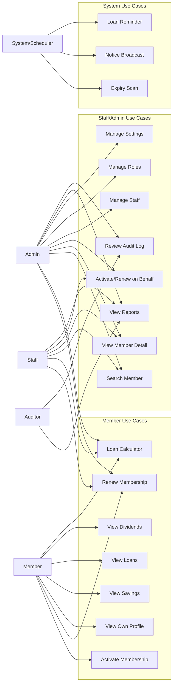

# USE_CASE_DIAGRAM

Status: ACCEPTED

## Security Boundary

All protected human use cases must receive an authenticated `Principal` and pass server-side authorization.

System use cases execute with a controlled system Principal.
