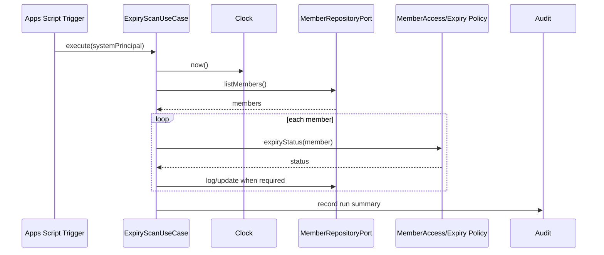

# SEQ-EXPIRY-SCAN

Status: TARGET / MIGRATION

```mermaid
sequenceDiagram
    participant Trigger as Apps Script Trigger
    participant UC as ExpiryScanUseCase
    participant Clock
    participant Repo as MemberRepositoryPort
    participant Policy as MemberAccess/Expiry Policy
    participant Audit

    Trigger->>UC: execute(systemPrincipal)
    UC->>Clock: now()
    UC->>Repo: listMembers()
    Repo-->>UC: members
    loop each member
      UC->>Policy: expiryStatus(member)
      Policy-->>UC: status
      UC->>Repo: log/update when required
    end
    UC->>Audit: record run summary
```
