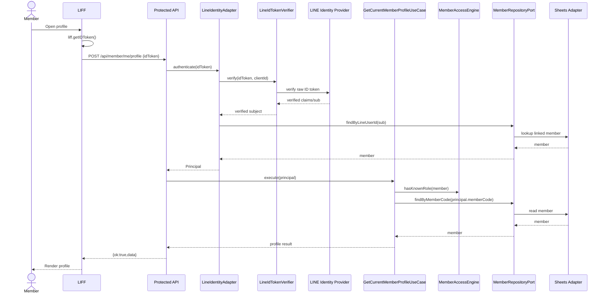

# SEQ-LIFF-AUTH-PROFILE

Status: ACCEPTED

```mermaid
sequenceDiagram
    actor Member
    participant LIFF
    participant API as Protected API
    participant Identity as LineIdentityAdapter
    participant Verify as LineIdTokenVerifier
    participant LINE as LINE Identity Provider
    participant UC as GetCurrentMemberProfileUseCase
    participant Access as MemberAccessEngine
    participant Repo as MemberRepositoryPort
    participant Sheets as Sheets Adapter

    Member->>LIFF: Open profile
    LIFF->>LIFF: liff.getIDToken()
    LIFF->>API: POST /api/member/me/profile {idToken}
    API->>Identity: authenticate(idToken)
    Identity->>Verify: verify(idToken, clientId)
    Verify->>LINE: verify raw ID token
    LINE-->>Verify: verified claims/sub
    Verify-->>Identity: verified subject
    Identity->>Repo: findByLineUserId(sub)
    Repo->>Sheets: lookup linked member
    Sheets-->>Repo: member
    Repo-->>Identity: member
    Identity-->>API: Principal
    API->>UC: execute(principal)
    UC->>Access: hasKnownRole(member)
    UC->>Repo: findByMemberCode(principal.memberCode)
    Repo->>Sheets: read member
    Sheets-->>Repo: member
    Repo-->>UC: member
    UC-->>API: profile result
    API-->>LIFF: {ok:true,data}
    LIFF-->>Member: Render profile
```
