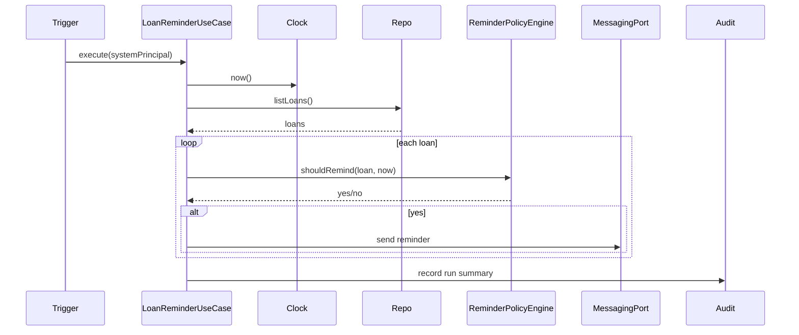

# SEQ-LOAN-REMINDER

Status: TARGET / MIGRATION

```mermaid
sequenceDiagram
    participant Trigger
    participant UC as LoanReminderUseCase
    participant Clock
    participant Repo
    participant Policy as ReminderPolicyEngine
    participant Msg as MessagingPort
    participant Audit

    Trigger->>UC: execute(systemPrincipal)
    UC->>Clock: now()
    UC->>Repo: listLoans()
    Repo-->>UC: loans
    loop each loan
      UC->>Policy: shouldRemind(loan, now)
      Policy-->>UC: yes/no
      alt yes
        UC->>Msg: send reminder
      end
    end
    UC->>Audit: record run summary
```
