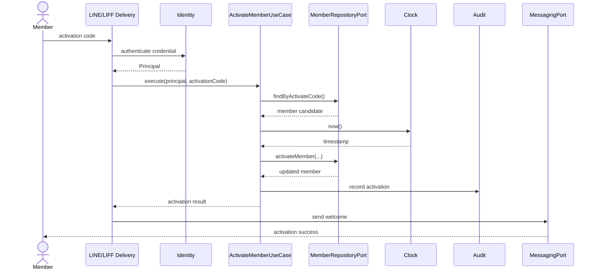

# SEQ-MEMBER-ACTIVATE

Status: TARGET / MIGRATION

```mermaid
sequenceDiagram
    actor Member
    participant Delivery as LINE/LIFF Delivery
    participant Identity
    participant UC as ActivateMemberUseCase
    participant Repo as MemberRepositoryPort
    participant Clock
    participant Audit
    participant Msg as MessagingPort

    Member->>Delivery: activation code
    Delivery->>Identity: authenticate credential
    Identity-->>Delivery: Principal
    Delivery->>UC: execute(principal, activationCode)
    UC->>Repo: findByActivateCode()
    Repo-->>UC: member candidate
    UC->>Clock: now()
    Clock-->>UC: timestamp
    UC->>Repo: activateMember(...)
    Repo-->>UC: updated member
    UC->>Audit: record activation
    UC-->>Delivery: activation result
    Delivery->>Msg: send welcome
    Msg-->>Member: activation success
```
