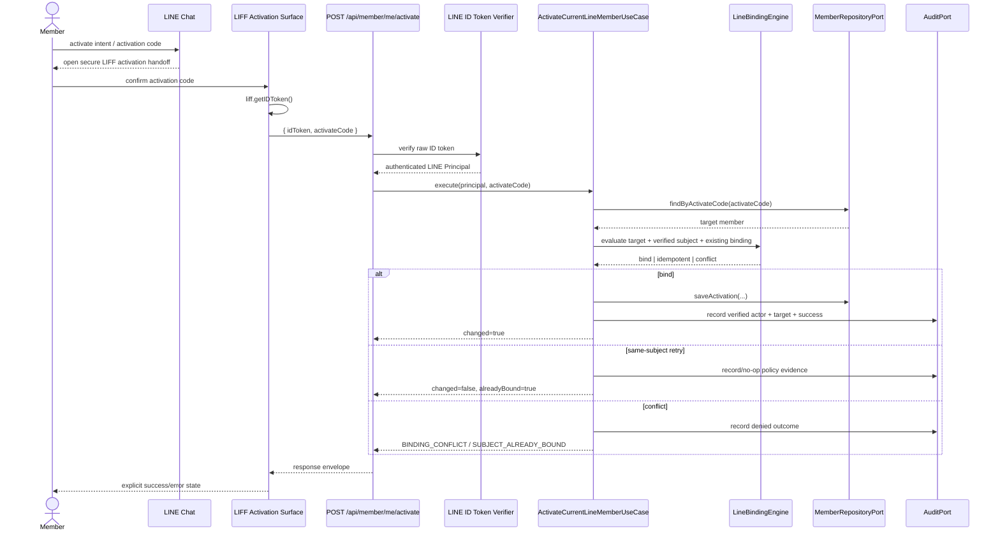

# SEQ-MEMBER-ACTIVATE

Status: TARGET / ACCEPTED  
Authority: ADR-0004

## Secure Self-Activation

## Security Invariants

- activation code proves entitlement only
- raw LINE ID token is verified server-side
- authoritative LINE subject is derived from verified claims
- no client-provided `lineUserId`
- staff/admin cannot directly select another user's LINE identity
- same-subject retry is idempotent
- different-subject binding takeover fails closed
- secure audit must not persist raw activation code
