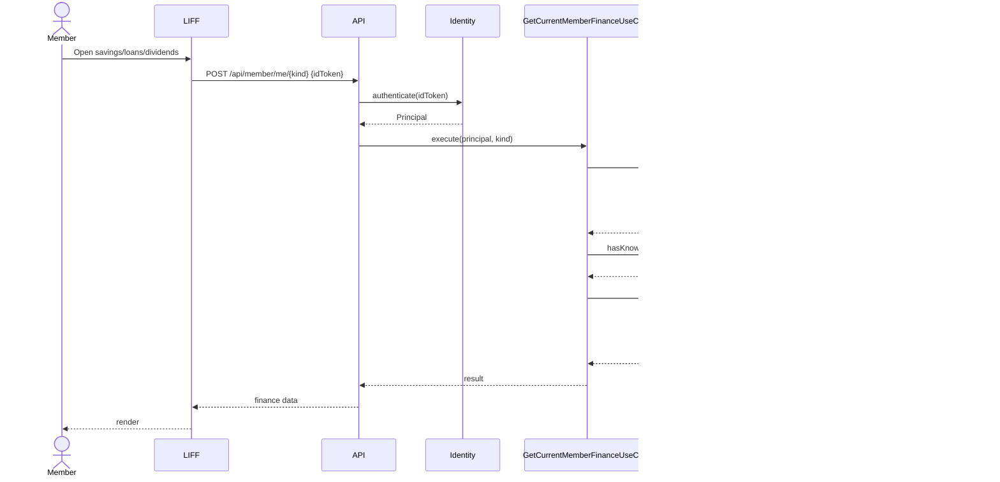

# SEQ-MEMBER-FINANCE

Status: ACCEPTED

```mermaid
sequenceDiagram
    actor Member
    participant LIFF
    participant API
    participant Identity
    participant UC as GetCurrentMemberFinanceUseCase
    participant Access as MemberAccessEngine
    participant Repo as MemberRepositoryPort
    participant Sheets

    Member->>LIFF: Open savings/loans/dividends
    LIFF->>API: POST /api/member/me/{kind} {idToken}
    API->>Identity: authenticate(idToken)
    Identity-->>API: Principal
    API->>UC: execute(principal, kind)
    UC->>Repo: findByMemberCode()
    Repo->>Sheets: read member
    Sheets-->>Repo: member
    Repo-->>UC: member
    UC->>Access: hasKnownRole(member)
    Access-->>UC: allow
    UC->>Repo: read finance(kind)
    Repo->>Sheets: query finance
    Sheets-->>Repo: rows
    Repo-->>UC: rows
    UC-->>API: result
    API-->>LIFF: finance data
    LIFF-->>Member: render
```
