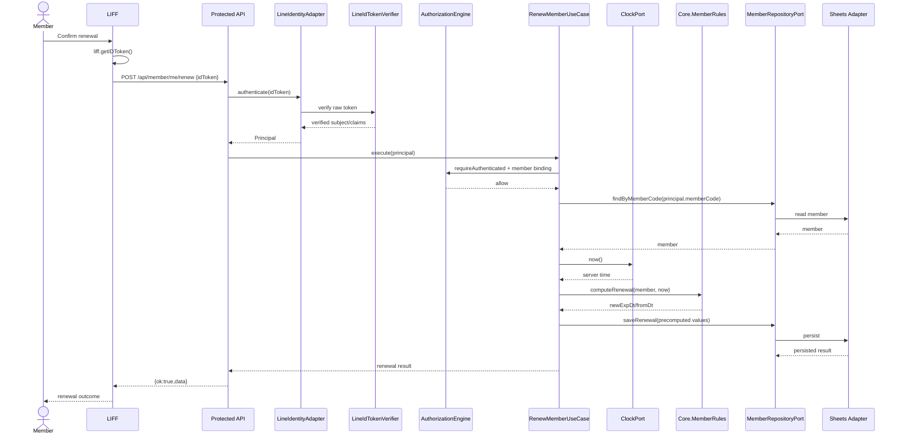

# SEQ-MEMBER-RENEW

Status: ACCEPTED / PRIMARY SELF-SERVICE PATH VERIFIED

## Security Rule

Client never chooses authoritative member identity, expiry date, or membership status.

Staff/Admin renewal-on-behalf requires a separate RBAC-controlled application path and must not reuse client-selected identity as authority.
