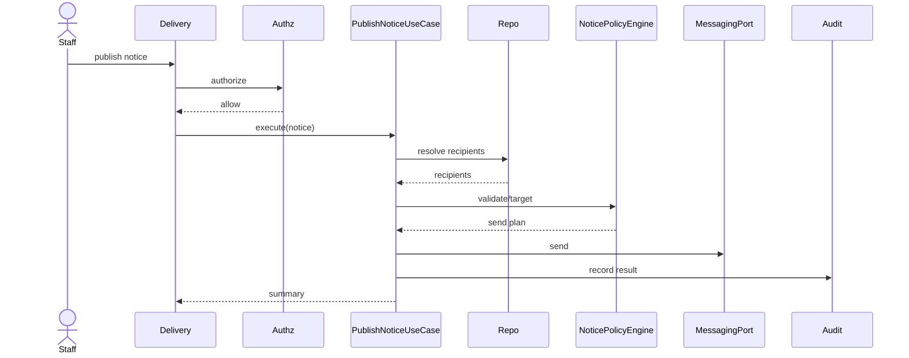

# SEQ-NOTICE-BROADCAST

Status: TARGET / MIGRATION

```mermaid
sequenceDiagram
    actor Staff
    participant Delivery
    participant Authz
    participant UC as PublishNoticeUseCase
    participant Repo
    participant Policy as NoticePolicyEngine
    participant Msg as MessagingPort
    participant Audit

    Staff->>Delivery: publish notice
    Delivery->>Authz: authorize
    Authz-->>Delivery: allow
    Delivery->>UC: execute(notice)
    UC->>Repo: resolve recipients
    Repo-->>UC: recipients
    UC->>Policy: validate/target
    Policy-->>UC: send plan
    UC->>Msg: send
    UC->>Audit: record result
    UC-->>Delivery: summary
```
