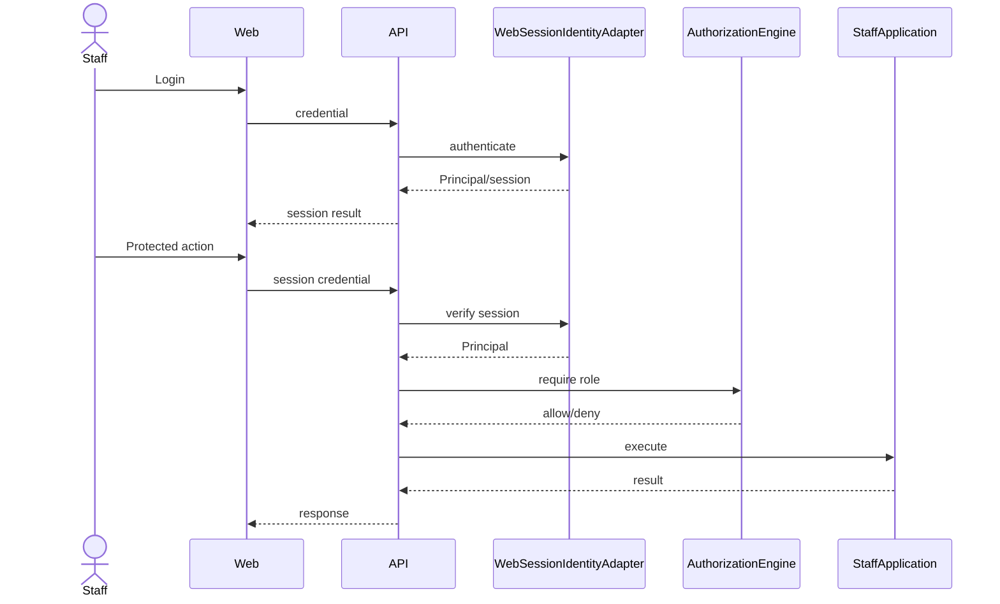

# SEQ-WEB-STAFF-LOGIN

Status: TARGET / SECURITY MIGRATION

```mermaid
sequenceDiagram
    actor Staff
    participant Web
    participant API
    participant Identity as WebSessionIdentityAdapter
    participant Authz as AuthorizationEngine
    participant UC as StaffApplication

    Staff->>Web: Login
    Web->>API: credential
    API->>Identity: authenticate
    Identity-->>API: Principal/session
    API-->>Web: session result

    Staff->>Web: Protected action
    Web->>API: session credential
    API->>Identity: verify session
    Identity-->>API: Principal
    API->>Authz: require role
    Authz-->>API: allow/deny
    API->>UC: execute
    UC-->>API: result
    API-->>Web: response
```
