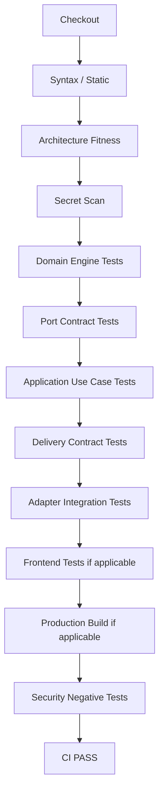

# CI_PIPELINE_STANDARD

Status: ACCEPTED  
Purpose: Mandatory engineering CI/CD quality pipeline

## PR Pipeline

## Mandatory Gates

### G0 — Checkout / Environment
- deterministic runtime
- pinned/supported toolchain where practical

### G1 — Syntax / Static
- syntax checks
- lint/type checks when supported
- malformed source detection

### G2 — Architecture Fitness
Examples:
- Core/Engine cannot import UI
- Core/Engine cannot call SpreadsheetApp/UrlFetchApp directly
- production mock-auth patterns forbidden
- adapter-only infrastructure dependency rules

### G3 — Secret Scan
- gitleaks
- private keys
- generic secrets
- accidental credentials

### G4 — Domain Engine
Properties:
- headless
- deterministic
- fast
- no network
- no production storage

### G5 — Port Contract
Adapter changes must pass reusable contract suites.

### G6 — Application Use Case
- orchestration
- authorization behavior
- negative flows
- dependency failure

### G7 — Delivery Contract
- API route/method
- envelope
- credential handling
- token not in URL when sensitive
- error mapping

### G8 — Adapter Integration
For Sheets/LINE/HTTP/config/audit etc.

### G9 — Frontend
When frontend changes:
- pure policy/store tests
- security scan
- production build
- critical component/router checks

### G10 — Security Negative
At minimum where relevant:
- missing credential
- invalid credential
- expired credential
- wrong audience
- malformed provider response
- unauthorized role
- inactive member
- provider unavailable
- storage failure

## Change-Based Test Selection

| Change | Required |
|---|---|
| Domain Engine | G1-G6 + regression |
| Port | G1-G8 |
| API | G1-G7 + affected integration |
| Identity/Auth | G1-G10 security relevant |
| Frontend | G1 + G9 + affected contracts |
| Data schema | contracts + migration + rollback tests |
| Scheduled job | engine/use-case + adapter + idempotency |

## CI Failure Policy

- no merge on red CI
- investigate first failing quality stage
- do not weaken assertion merely to make build green
- test-double drift is fixed in test wiring, not by weakening production contract
- flaky test is a defect
- rerun alone is not a fix unless external transient cause is evidenced

## Required Evidence

Every merged PR must have:
- PR number
- merge commit
- CI run identifier
- test stage conclusions
- SSOT traceability update where applicable
