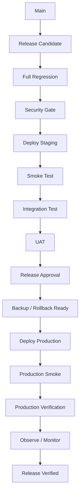

# RELEASE_DEPLOYMENT_PIPELINE

Status: ACCEPTED  
Purpose: Best-practice controlled promotion to production

## Principle

Merge to `main` is not equivalent to production deployment.

## Canonical Release Pipeline

## Stage Requirements

### RC
- version/baseline identified
- migration notes
- known risks
- no Critical/High unresolved blockers

### Full Regression
- TS-00 through applicable TS-70
- all critical user journeys

### Security Gate
Mandatory for:
- authn/authz
- member/financial data
- external identity
- permissions
- secrets/config

### Staging
- production-like configuration
- non-production data
- deployment steps verified

### Smoke
- health
- login/auth
- read-only critical path
- primary LINE/LIFF/Web entrypoints

### Integration
- LINE
- Apps Script
- Sheets
- external identity provider
- messaging

### UAT
Actors:
- Member
- Staff
- Admin
- Auditor where applicable

### Release Approval
Evidence package:
- test summary
- security status
- rollback plan
- data migration status
- deployment checklist

### Backup / Rollback
Required:
- recoverable baseline
- configuration backup
- rollback steps
- data rollback/restore path where applicable

### Production Deployment
- controlled
- logged
- version recorded

### Production Verification
TS-90:
- health
- safe authenticated profile
- safe read-only member finance check
- logs clean
- no secret/error leakage
- expected version active

### Observation
Monitor:
- errors
- auth failures
- webhook failures
- integration failures
- quota/resource limits

## Emergency Rule

Emergency hotfix may shorten review flow only when:
- incident severity justifies it
- change is minimal/reversible
- automated smoke/security checks still run
- post-incident review and SSOT evidence are mandatory

## Release DONE

A release is DONE only when:
- production version verified
- rollback remains available
- evidence recorded
- release notes/status updated
- no unresolved release-blocking defect
