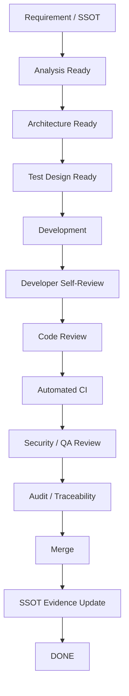

# TEAM_DEVELOPMENT_PIPELINE

Status: ACCEPTED  
Purpose: Project-wide best-practice delivery pipeline  
Authority: PROJECT_CHARTER / ADR-0002 / ADR-0003 / AGILE_KANBAN / TEST_SUITE_CATALOG

## Objective

กำหนดเส้นทางมาตรฐานของทุก work item ตั้งแต่ requirement จนถึง DONE เพื่อให้ทีมพัฒนาทำงานสม่ำเสมอ ตรวจสอบย้อนกลับได้ และไม่ข้าม quality gate

## Canonical Pipeline

## Stage Gates

### 1. Requirement / SSOT
Entry:
- work item exists
- business goal known

Exit:
- Requirement ID / Use Case ID
- Acceptance Criteria
- priority
- dependencies
- security/data impact

Owner:
- Product/Project

Evidence:
- GitHub Issue
- SSOT link

### 2. Analysis Ready
Required:
- Actor
- Use Case
- Workflow
- relevant Sequence Diagram
- error/alternative flows

Owner:
- Analyst / Architect / Product

Exit rule:
No implementation if actor/use case boundary is unclear.

### 3. Architecture Ready
Required:
- Engine / Application / Port / Adapter ownership
- dependency wiring
- API/data contract impact
- ADR if controlled architecture/security change

Owner:
- Senior Engineer / Architect

### 4. Test Design Ready
Required:
- positive tests
- negative tests
- boundary cases
- regression characterization where legacy behavior changes
- applicable Test Suite IDs

Owner:
- Tester + Developer

### 5. Development
Rules:
- small coherent changes
- commit frequently
- push frequently
- no silent contract drift
- implementation follows target architecture
- UI must not own business policy

Owner:
- Developer

### 6. Developer Self-Review
Checklist:
- acceptance criteria satisfied
- no debug/mock production fallback
- no duplicated business rule
- errors fail closed where security-related
- tests added/updated
- docs impacted?

Owner:
- Developer

### 7. Code Review
Review:
- correctness
- architecture
- maintainability
- security
- data impact
- test adequacy
- backward compatibility

Owner:
- Reviewer / Senior Engineer

### 8. Automated CI
Minimum:
- TS-00
- TS-10
- TS-20
- TS-30
- TS-40 where applicable

Conditional:
- TS-50 infrastructure
- TS-60 frontend

Failure:
- card remains REVIEW/TEST
- no merge
- fix root cause; never bypass gate without approved exception

### 9. Security / QA Review
Required for:
- authentication
- authorization
- personal/member/financial data
- new external integration
- write operations
- permission changes

### 10. Audit / Traceability
Required:
- Requirement → Design/ADR → Source → Test → CI evidence
- migration ledger updated when legacy code is replaced

Owner:
- Tester/Auditor

### 11. Merge
Rules:
- PR only
- CI green
- required review complete
- expected head SHA verified where supported

### 12. SSOT Evidence Update
Update:
- TRACEABILITY_MATRIX
- REDESIGN_MIGRATION_LEDGER
- SYSTEM_BASELINE when material
- Kanban/Issue state

### 13. DONE
DONE means:
- merged
- tests/evidence complete
- docs synchronized
- no unresolved Critical/High finding relevant to item

## WIP Integration

Map to Kanban:

| Pipeline | Kanban |
|---|---|
| Requirement/Analysis/Architecture/Test Design | READY |
| Development + Self-Review | IN_PROGRESS |
| Code Review | REVIEW |
| CI + QA + Security + Audit | TEST |
| Merge + SSOT Evidence | DONE |
| blocked dependency/failure | BLOCKED |

## Best-Practice Rules

1. Shift-left testing
2. Shift-left security
3. Fail closed
4. Functional core / imperative shell
5. Engine-first
6. Explicit dependencies
7. Replaceable adapters
8. Evidence-driven completion
9. Small reversible changes
10. No big-bang rewrite unless separately approved
